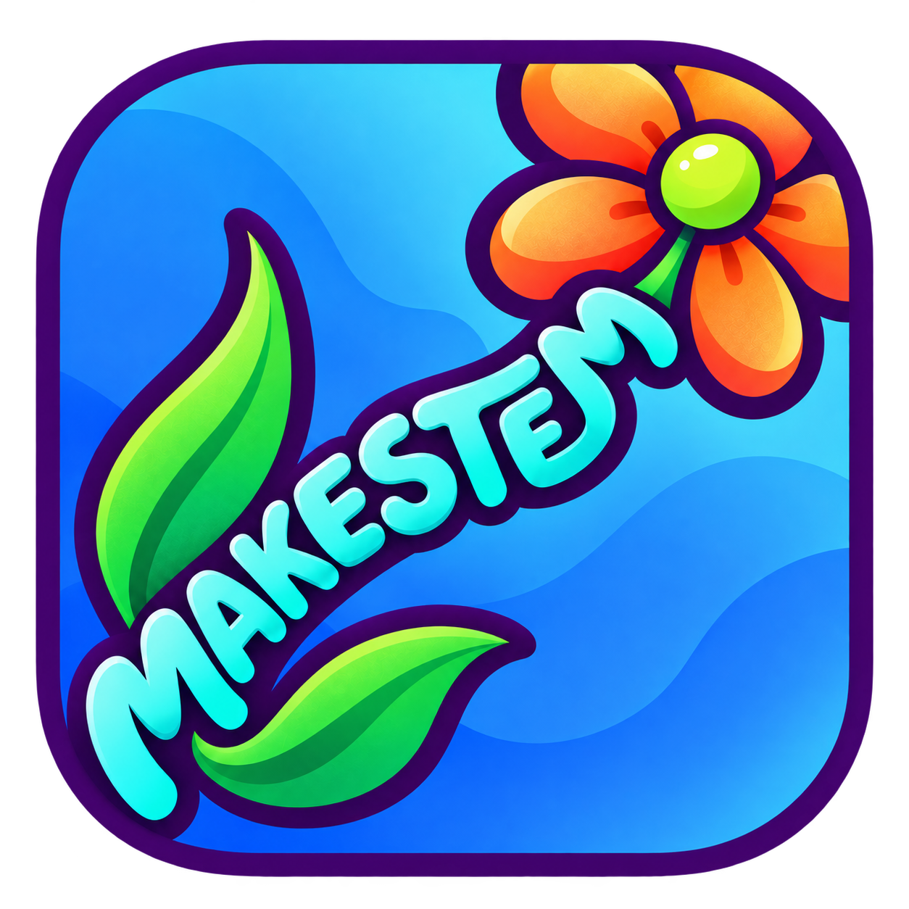
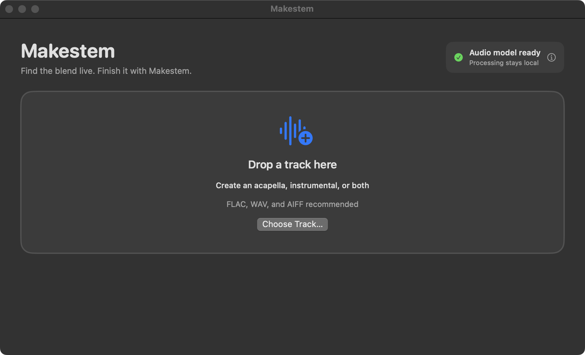
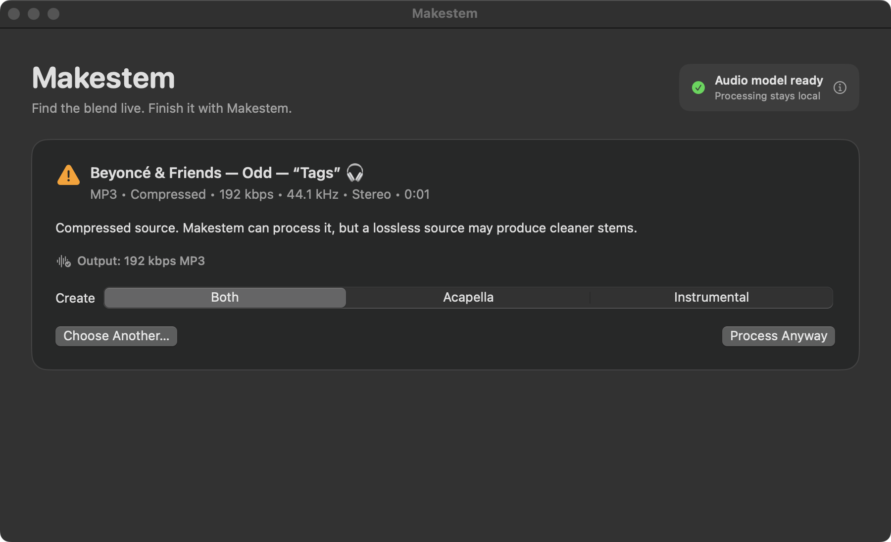

<p align="center">
  
</p>

# Makestem

**Find the blend live. Finish it with Makestem.**

Makestem turns a full track into a high-quality acapella, instrumental, or
both—ready for recorded and shareable DJ blends.

Drop in a FLAC, WAV, AIFF, or MP3. Makestem checks the track, separates it on
your Mac, and saves DJ-ready MP3s beside the original. Your music is never
uploaded.

Serato Stems is invaluable for discovering blends live. When you find one
worth recording and sharing, Makestem takes the slower, higher-quality route.

> Serato Stems helps you discover the blend. Makestem helps you finish it.

Makestem is an independent project and is not affiliated with or endorsed by
Serato.

<p align="center">
  
  
</p>

## Mac app

Makestem supports Apple Silicon Macs running macOS 14 or newer.

1. Download the DMG from the [latest release](../../releases/latest).
2. Open it and drag **Makestem** into **Applications**.
3. Open Makestem from Applications and download the audio model when prompted.

The app is signed and notarized by Apple. No Homebrew, Terminal, or developer
tools are required.

### Create stems

1. Drop a track into Makestem, or choose one from Finder.
2. Choose **Both**, **Acapella**, or **Instrumental**.
3. Select **Create Stems** and follow the progress.
4. Reveal the finished files in Finder.

FLAC, WAV, and AIFF sources are recommended. MP3, OGG, M4A, and AAC also work,
but Makestem warns when a compressed source might produce less-clean stems.

The first run downloads the 336 MB `htdemucs_ft` audio model. Makestem verifies
the download and keeps it for later use. After that download, all processing
happens locally.

You can cancel a model download or separation and retry without leaving partial
files behind. If a track is damaged, unsupported, missing audio, or cannot be
read or saved, Makestem gives concise guidance about what to try next.

## Output

Results appear in an `output` folder beside the source track:

```text
output/
├── Track Title (Acapella).mp3
└── Track Title (Instrumental).mp3
```

Makestem preserves source metadata and adds `(Acapella)` or `(Instrumental)` to
the track title. Lossless sources produce 320 kbps MP3s. Compressed sources are
never needlessly up-encoded: output quality is capped at the detected source
quality, including an appropriate profile for VBR MP3s.

Existing stems are never silently overwritten. The app asks first, creates the
replacement completely, and preserves the old file if processing fails or is
cancelled.

## Command line

The CLI is intended for people comfortable with Terminal. It requires Demucs,
FFmpeg, and FFprobe on your `PATH`.

From this checkout:

```sh
cargo install --path . --locked
```

Then change into a folder containing a track and run:

```sh
makestem -a "Track Title.flac"   # acapella only
makestem -i "Track Title.flac"   # instrumental only
makestem "Track Title.flac"      # both
```

Use `--replace` to replace an existing requested output. Quotes protect paths
containing spaces; punctuation and Unicode filenames are supported.

## Build the Mac app

Building requires a current [Rust toolchain](https://rustup.rs/), Xcode 26 or
newer, and a Metal-capable Apple Silicon Mac.

Install the native [demucs-rs CLI](https://github.com/nikhilunni/demucs-rs):

```sh
git clone https://github.com/nikhilunni/demucs-rs.git
cd demucs-rs
cargo install --path demucs-cli --locked
```

From the Makestem checkout, build the pinned FFmpeg tools and app:

```sh
./scripts/build-ffmpeg-macos.sh
./scripts/build-mac-app.sh
open build/Makestem.app
```

The resulting development build is ad-hoc signed for local testing. The Xcode
project is at `macos/Makestem.xcodeproj`.

## Development

Run every automated check:

```sh
./scripts/test-all.sh
```

This checks Rust formatting, tests, and linting; runs the Swift tests and a
real-audio format matrix; builds the complete app; and validates its bundled
tools, licenses, metadata, deployment target, architecture, and signatures.

To include a slow, real Demucs separation using a short disposable track:

```sh
MAKESTEM_REAL_AUDIO_SMOKE=1 \
MAKESTEM_SMOKE_TRACK="/path/to/short-test.flac" \
./scripts/test-all.sh
```

## Create a direct-download release

Releases use a locally installed **Developer ID Application** certificate and a
notarization profile stored in the macOS Keychain. Credentials are never kept
in this repository.

Create a signed DMG locally:

```sh
./scripts/release-macos.sh
```

Create the distributable DMG, submit it to Apple, and staple the notarization
ticket:

```sh
./scripts/release-macos.sh --notarize
```

The finished `dist/Makestem-VERSION.dmg` includes Makestem, Demucs, FFmpeg, and
FFprobe. Friends only download the audio model on first use; they do not need
Homebrew, Rust, Xcode, or Terminal.
